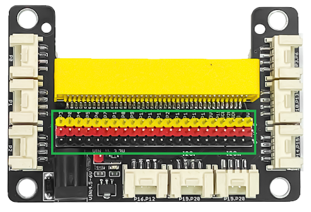

## 🛠 Sơ Đồ Chân (Pinout) YoloBit

YoloBit sử dụng **ESP32** làm vi điều khiển chính. Dưới đây là sơ đồ chân quan trọng:

### 📌 Bảng GPIO của YoloBit

| **Chân YoloBit** | **GPIO trên ESP32** | **Chức năng** |
|------------------|--------------------|---------------|
| P0              | GPIO32              | Digital, PWM, ADC |
| P1              | GPIO33              | Digital, PWM, ADC |
| P2              | GPIO27              | Digital, PWM, ADC |
| P3              | GPIO2              | Digital, PWM, ADC |
| P4              | GPIO15              | Digital, PWM |
| P6              | GPIO12               | Digital, PWM |
| P10             | GPIO26              | Digital, PWM |
| P12             | GPIO13               | Digital, PWM |
| P13             | GPIO18               | Digital, PWM, ADC |
| P14             | GPIO19               | Digital, ADC (Chỉ đọc) |
| P15             | GPIO23               | Digital, ADC (Chỉ đọc) |
| P16             | GPIO5                | Digital, PWM |
| SCL             | GPIO22               | I2C Clock |
| SDA             | GPIO21               | I2C Data |
| TX              | GPIO1                | UART TX |
| RX              | GPIO3                | UART RX |
| MISO            | GPIO19               | SPI MISO |
| MOSI            | GPIO23               | SPI MOSI |
| SCK             | GPIO18               | SPI Clock |
| CS              | GPIO5                | SPI Chip Select |
| GND             | -                    | Ground |
| 3V3             | -                    | 3.3V |
| 5V              | -                    | 5V |

### 🔌 Lưu Ý Khi Sử Dụng GPIO Trên YoloBit

- **P0 → P3 hỗ trợ ADC** (Analog Input).
- **P4 → P10 hỗ trợ Digital I/O & PWM**.
- **GPIO1 và GPIO3 dùng cho UART (Serial)**, tránh sử dụng khi kết nối USB.
- **SCL (GPIO22) và SDA (GPIO21)** dùng cho giao tiếp I2C.
- **Một số chân không nên kéo xuống GND khi khởi động** (như GPIO0, GPIO2).

### 🖼️ Sơ Đồ Mạch Mở Rộng

### 🖼️ Sơ Đồ Nối Dây

