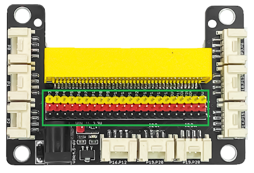
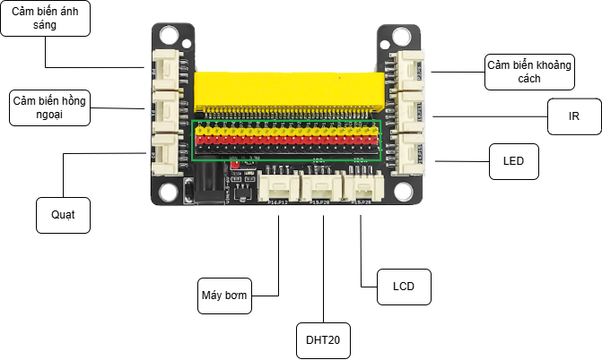

## Yolobit

YoloBit use **ESP32** being main MCU. It has 16 GPIO pins, 2 I2C pins, 2 UART pins, 1 SPI pins, 1 ADC pin, 1 DAC pin, and 1 PWM pin.:

### Pinout of YoloBit:

| **Chân YoloBit** | **GPIO trên ESP32** | **Chức năng**            |
| ---------------- | ------------------- | ------------------------ |
| P0               | GPIO32              | Digital, PWM, ADC        |
| P1               | GPIO33              | Digital, PWM, ADC        |
| P2               | GPIO27              | Digital, PWM, ADC        |
| P3               | GPIO2               | Digital, PWM, ADC        |
| P4               | GPIO15              | Digital, PWM             |
| P6               | GPIO12              | Digital, PWM             |
| P10              | GPIO26              | Digital, PWM             |
| P12              | GPIO13              | Digital, PWM             |
| P13              | GPIO18              | Digital, PWM, ADC        |
| P14              | GPIO19              | Digital, ADC (Only read) |
| P15              | GPIO23              | Digital, ADC (Only read) |
| P16              | GPIO5               | Digital, PWM             |
| SCL              | GPIO22              | I2C Clock                |
| SDA              | GPIO21              | I2C Data                 |
| TX               | GPIO1               | UART TX                  |
| RX               | GPIO3               | UART RX                  |
| MISO             | GPIO19              | SPI MISO                 |
| MOSI             | GPIO23              | SPI MOSI                 |
| SCK              | GPIO18              | SPI Clock                |
| CS               | GPIO5               | SPI Chip Select          |
| GND              | -                   | Ground                   |
| 3V3              | -                   | 3.3V                     |
| 5V               | -                   | 5V                       |

### Layout of Grove Shield

### Wiring Diagram

